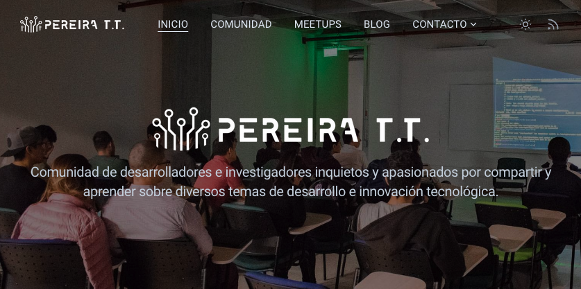

# 🚀 Pereira Tech Talks

Este es el repositorio web oficial de [pereiratechtalks.org](https://pereiratechtalks.org), una comunidad vibrante de profesionales, desarrolladores e investigadores dedicados a compartir conocimiento sobre tecnología..

## 🌟 Acerca del Proyecto.

Pereira Tech Talks es una iniciativa que busca fomentar el intercambio de ideas y experiencias en el mundo de la tecnología. Nuestra plataforma web es el punto de encuentro para nuestra comunidad, donde compartimos eventos, recursos y contenido valioso.

## 🤝 Cómo Contribuir

¡Nos encanta recibir contribuciones de la comunidad! Si quieres aportar, aquí tienes algunas formas de hacerlo: [Instrucciones de Contribución](CONTRIBUTING.md)

## 📝 Licencia

Este proyecto está bajo la Licencia MIT. Consulta el archivo [LICENSE](LICENSE) para más detalles.

## 📞 Contacto

Si tienes preguntas o sugerencias, no dudes en unirte a nuestra comunidad en Whatsapp y seguirnos en nuestras diferentes redes sociales:

- [Comunidad en Whatsapp](https://chat.whatsapp.com/EzYAadvUWyVBHt3m1FU77U)
- [Website](https://www.pereiratechtalks.org/)
- [X - @PerTechTalks](https://x.com/pertechtalks)
- [Instagram](https://www.instagram.com/pertechtalks)
- [Facebook](https://www.facebook.com/PerTechTalks)
- [LinkedIn](https://www.linkedin.com/company/35508463/)
- [Linktr](https://linktr.ee/pertechtalks)
- [pereiratechtalks@gmail.com](mailto:pereiratechtalks@gmail.com)

¡Gracias por ser parte de Pereira Tech Talks! Juntos estamos construyendo una comunidad tecnológica más fuerte y colaborativa.
